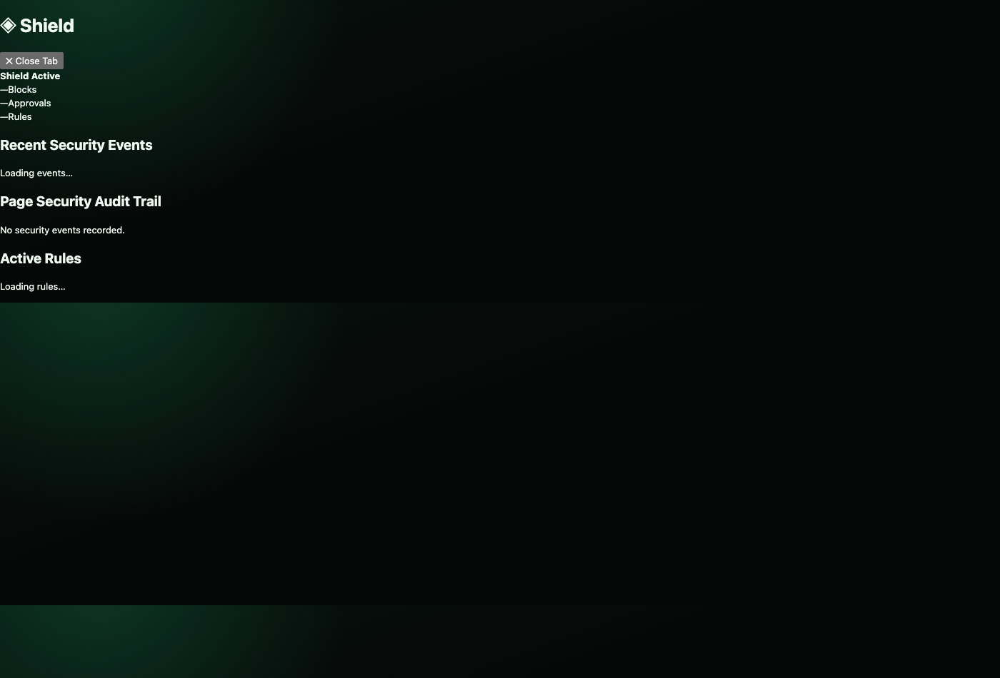

# Security & Hardening




**PR: Core Security Components**

Adds security monitoring, wallet detection, audit logging, and a CI pipeline to the browser-first extension.

## Shield — Security Audit Trail

Real-time security log showing what the AI blocked, approved, or flagged. Reads from `chrome.storage.local` where the content script logs security events, and updates live via `storage.onChanged`.

All rendered output is XSS-protected via `escapeHtml()` on every untrusted field.

## Wallet Adapter — Phantom Detection

Read-only Phantom wallet detection:
- Detects wallet presence via content script delegation (never accesses `window.phantom` directly from extension pages)
- Reads public key only
- `wallet_connect` and `wallet_sign` are both gated through `requestApproval()` before any action
- Filters active tab to `https://` URLs before wallet operations
- No private key handling anywhere in the codebase

## Audit Trail

Server-side security event logger (`audit-trail.mjs`). Writes wallet audit events to `wallet-audit.jsonl` with timestamps, action types, and page URLs.

## CI Pipeline

GitHub Actions workflow (`.github/workflows/browser-first-ci.yml`):
- Node 22+
- Manifest validation
- Syntax check
- Full test suite
- `npm audit --audit-level=moderate` (enforced, not silenced)
- Actions SHA-pinned to immutable commit digests (not mutable version tags)

## Tests

```bash
node --test browser-first/test/shield-tab.test.mjs browser-first/test/wallet-adapter.test.mjs
# 16 tests, 0 failures
```

## Files

```
browser-first/
  resonantos-side-panel-extension/src/
    shield-tab.html / shield-tab.js
    wallet-adapter.js
  addons/
    shield/addon.json
    wallet-adapter/addon.json
  host/
    audit-trail.mjs
  test/
    shield-tab.test.mjs (8 tests)
    wallet-adapter.test.mjs (8 tests)
.github/workflows/
  browser-first-ci.yml
```

---

# ResonantOS Browser-First Prototype

Intent citation: `docs/architecture/ADR-037-browser-first-chromium-resonantos.md`

This directory is the new product path for ResonantOS as a browser-first app.

The target is not:

- a Tauri dashboard with a webview
- an Electron sidecar
- an external Chrome/Brave process controlled by CDP
- a screenshot browser

The target is a Chromium-family browser where ResonantOS lives inside browser chrome.

## Current Slice

The first implemented slice is a Chromium extension-style ResonantOS side panel:

- `resonantos-side-panel-extension/manifest.json`
- `src/background.js`
- `src/content.js`
- `src/side-panel.html`
- `src/side-panel.js`
- `src/side-panel.css`

This is intentionally small. It proves the product direction: ResonantOS functionality must be packaged as a browser-contained layer that can later be bundled into a Chromium shell.

## Non-Negotiable Gates

Before this becomes the default app:

- Phantom must install/open in the same browser profile.
- A local dApp fixture must detect Phantom provider injection.
- Wallet connect/sign flows must require human approval.
- Augmentor must control the active tab only through typed mediated tools.
- No page, add-on, or assistant can get raw wallet/signing power.

## Browser Control Layer v3

Augmentor stays in the side panel. Browser actions target the active webpage tab through content-script messages:

- read page context
- click visible non-submit page controls by text
- type into focused or normal editable fields
- submit search-like fields only
- scroll the active webpage
- inspect forms and loose editable fields

Approval-gated actions are blocked until a dedicated approval flow exists:

- wallet connect/sign/network switch
- credential autofill
- public form submit
- payment, purchase, publish, share, or destructive document actions

The current command surface:

```text
/control <browser goal>
/browser read
/browser forms
/browser click "Visible text"
/browser type "Text to type"
/browser scroll down
/browser scroll up
/browser scroll top
/browser scroll bottom
/save page
/save selection
/save summary
/save trail <title>
/trail <title>
```

Agent Control Mode starts with `/control <goal>` or natural browser-task requests such as `book a call`, `arrange a meeting`, `fill this form`, `find news`, or `use this page`.

V3 is an adaptive observe-decide-act-verify loop:

1. observe the active controlled tab, including readable frames
2. ask the configured LLM for exactly one strict JSON next action
3. validate that action against the host safety boundary
4. execute only the typed mediated browser tool
5. observe the page again before choosing the next action
6. continue until the observed page state proves completion, the task blocks, or approval is required

The LLM is only a next-action controller. It cannot execute browser actions directly. The host validates every proposed action, rejects unsupported actions, caps the loop at twelve actions, and falls back to the deterministic parser when the next-action route is unavailable.

The side panel keeps a stable controlled-tab binding. This prevents the assistant from accidentally acting on the side-panel tab instead of the webpage being controlled.

Page observations now expose stable `ref` identifiers for visible controls and editable fields. The model should prefer refs over text labels when it decides to click or type, because refs avoid ambiguity on pages with repeated labels, icon buttons, and embedded frames.

Observations also include a compact list of readable open tabs. This gives Augmentor browser-session awareness without granting uncontrolled tab mutation. Acting across tabs will require explicit mediated tab tools.

V3 now includes mediated tab tools:

- `tabs` lists readable open tabs
- `switch_tab` changes the controlled tab to a specific observed tab id

This keeps tab work inside the same permissioned control loop instead of giving the model raw browser automation access.

The side panel now includes an Agent Control Monitor:

- current goal and run status
- planned steps with pending, active, completed, blocked, or failed state
- expandable action details covering observation, decision, action, result, and safety class
- completion and blocker summary cards for fast replay
- approval card for public-submit and other gated actions
- deny/delegate actions for blocked work
- Living Archive intake artifact path when a browser-control report is recorded

Browser memory commands remain intake-only:

- `/save page` captures the current page source context into Living Archive intake
- `/save selection` captures selected page text into Living Archive intake
- `/save summary` creates a provider-backed page summary intake artifact with source provenance and deterministic fallback
- `/save trail <title>` or `/trail <title>` captures readable open web tabs as one multi-page research trail intake bundle

All browser memory commands queue review requests. They do not write trusted wiki pages directly.

Allowed next actions are:

- `read`
- `open`
- `search`
- `forms`
- `tabs`
- `switch_tab`
- `click` by visible text or observed `ref`
- `type` by field label or observed `ref`
- `scroll`
- `wait`

The native Browser host also accepts `--remote-debugging-port=<port>` for deterministic local testing. This is a test/control-plane hook, not a user-facing permission escalation.

Structured page edits, such as Google Sheet row/cell changes, must resolve to a precise target before execution. The assistant may read the page and ask for a cell, visible control, or focused field, but it must not guess canvas/document coordinates.

## Run Contract Tests

```bash
node --test browser-first/test/*.test.mjs
```

## Run Live Browser Control Test

This launches the real browser-first CEF host with a local fixture and verifies browser behavior through CDP:

```bash
npm run test:browser-first-live
```

The live test proves:

- natural browser-task phrasing routes into Agent Control Mode
- iframe context is visible to the controller
- a differently worded booking request can click a visible iframe appointment slot
- safe page read, ref-targeted click, ref-targeted type, and scroll
- document-like contenteditable typing
- public form submit remains blocked at the approval boundary
- wallet-style work stops at the approval boundary

---

## Security

All security enforcement runs host-side behind the bridge server:

- All API keys and credentials stay on the host behind the bridge server
- Extension never makes direct network calls to fleet machines or cloud APIs
- Bridge token authentication on all routes
- Content Security Policy on all HTML pages
- `detectInjection()` with NFKC normalization and zero-width character stripping
- Sender validation on all `chrome.runtime.onMessage` handlers
- Addon manifests validated for path traversal, trust claims, symlink escape, injection
- 9 penetration test vulnerabilities found and fixed (4 Critical, 5 High)

### Shield Tab

The Shield tab (`shield-tab.html` / `shield-tab.js`) provides a live security audit log UI:
- Displays security events from the bridge audit trail
- Filters by severity (critical, high, medium, low)
- Exportable event log

### Audit Trail

`host/audit-trail.mjs` logs all security-relevant bridge events:
- Manifest validation failures
- Path traversal attempts
- Trust escalation attempts
- Token auth failures

### Wallet Adapter

`wallet-adapter.js` handles Phantom wallet detection and approval gating:
- Detects injected Phantom provider
- All wallet operations (connect, sign, switch network) require human approval
- Never grants raw wallet/signing power to addons or assistants

### Addon Manifests

| Addon | ID | Mode | Trust |
|-------|----|------|-------|
| Shield | `addon.shield` | `security-monitor` | `host-mediated` |
| Wallet Adapter | `addon.wallet-adapter` | `utility` | `host-mediated` |

### CI

GitHub Actions at `.github/workflows/browser-first-ci.yml`:
- Node 22+, manifest validation, syntax check, full test suite
- Triggers on push/PR to `browser-first-preview`